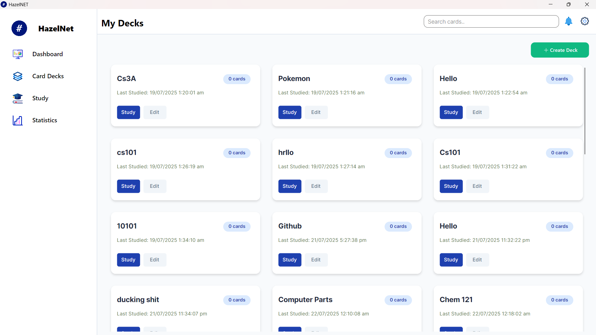

# HazelNet

A modern flashcard and study application built with .NET and AvaloniaUI for efficient studying and knowledge retention.

> **Note: In development so most features are not ready / implemented**

## Planned Features

- **Deck Management**: Create, edit, manage, and organize multiple card decks
- **Study Mode**: Interactive flashcard studying with progress tracking
- **Dashboard**: Overview of all your decks with study statistics
- **Card Management**:Create, edit, delete, and organize each Cards
- **Search Functionality**: Quickly find specific cards or decks
- **Statistics**: Monitor your study progress and performance
- **Pomodor Timer**: Time your studied effeciently using Pomodoro technique
- **Todo List**: List down all tasks that needs to be accomplished

## Screenshots


*"Card Decks" tab showing deck overview*

## Project Structure

```
Kards.NET/
├── Dependencies/
├── Assets/
├── DBContext/
├── Migrations/
├── Models/
├── Services/
├── ViewModels/
└── Views/

```


## Usage

### Creating a New Deck

1. Click the "Create Deck" button on the Card Decks Tab
2. Enter a name for your deck
3. Save your deck

### Studying

1. Select a deck from the dashboard /  Study / Card Deck Tab
2. Click the "Study" button
3. Review cards and mark your confidence level
4. Track your progress in the Statistics section

### Managing Decks

- **Edit**: Modify deck names and add/remove cards
- **Delete**: Remove unwanted decks
- **Search**: Use the search bar to quickly find specific decks

## Architecture

This application follows the MVVM (Model-View-ViewModel) pattern:

- **Models**: Data entities and business logic
- **Views**: XAML user interface files
- **Code Behind**: UI functinalities
- **ViewModels**: Presentation logic and data binding
- **Services**: Business services and data access
- **DBContext**: Entity Framework database context


## License

This project is licensed under the MIT License - see the [LICENSE](LICENSE) file for details.


